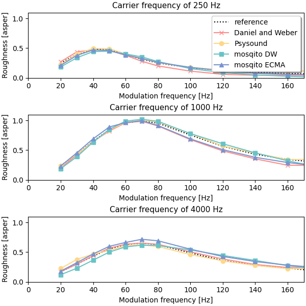

# MOSQITO Documentation
## Roughness computation (Daniel and Weber)

### Introduction

Several models have been developed to compute the acoustic roughness. No standardized method was proposed until recently (with the ECMA 418-2). The present implementation is based on the algorithm described in Daniel and Weber, 1997.

A step by step description of how to use MOSQITO to compute the roughness is given in [this tutorial](../tutorials/tuto_roughness_dw.ipynb).

### Validation of the implementation

H.Fastl and E.Zwicker proposed some reference values for the roughness of amplitude-modulated tones in figure 11.2 of Zwicker and Fastl, 2007. 
 
In Mosqito the test AM tones are generated using the '[signals_test_generation](../tests/sq_metrics/roughness/signals_test_generation.py)' script, in accordance with the equation (1) from the Daniel and Weber article. 

The plot below compares different roughness implementations' results for amplitude-modulated tones (carrier frequency of 250, 1000, 4000 Hz and modulation frequency from 10 to 400 Hz):
- Daniel and Weber implementation described in the 1997 article (results from figure 3)
- [Psysound3 software](https://github.com/densilcabrera/psysound3)
- Mosqito 

Mosqito implementation give similar results as other implementations. Zwicker and Fastl recommand that any roughness computation should give results within a +/- 17% range around their reference values. Note that none of the 3 implementations respect this criteria. However, Daniel and Weber algorithm is considered as a reference. Any improvement of the roughness assessment is welcome to be implemented in Mosqito.

*All the plots and scripts for more detailed validation can be found in [this folder](../validations/sq_metrics/roughness_dw/).* 

### References

P.Daniel and R.Weber: *Psychoacoustical roughness: implementation of an optimized model*, Acustica acta.acustica, 1997.

H.Fastl and E.Zwicker: *Psychoacoustics*, Springer, Berlin, Heidelberg, 2007. 
