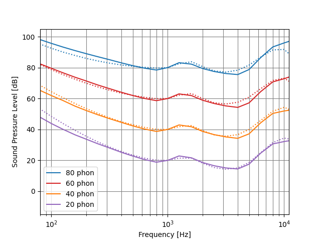

# MOSQITO Documentation
## Loudness according to ECMA 418-2

### Introduction

### Validation of the implementation
The ECMA loudness calculation is evaluated as proposed in the annex A of the standard. The loudness is calculated for sinusoidal signals with a frequency of 1000 Hz and a sound pressure level of 20 to 80 dB with a step size of 20 dB. For other frequencies, the level is varied to match the loudness calculated for the 1000 Hz tone. The results are shown in the figure below (to be compared to the Figure A.1 of the standard. The target equal-loudness contours are emulated well by the results of the hearing model.

### References

ECMA-418-2, Psychoacoustic metrics for ITT equipment — Part 2 (models based on human perception), 1st edition (December 2020)
ISO 226:2003, Acoustics — Normal equal-loudness-level contours
