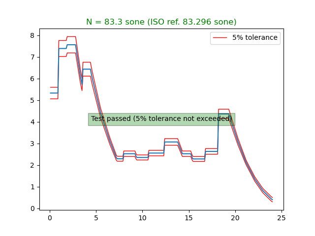

# MOSQITO Documentation
## Loudness of stationary signals (Zwicker method)

### Introduction

The acoustic loudness calculation according to Zwicker method was introduced as a standard in the 1975 version of ISO 532 (as method B). In 1991, the DIN 45631 standard proposed an implementation of the ISO 532:1975 method B with specific corrections to match the equal loudness contours of ISO 226:1987. In 2017, this method is included in the revision of ISO 532 (as section 5 of part 1, dedicated to Zwicker method). Note that, for normative continuity, the method is still in accordance with ISO 226:1987 equal loudness contours (instead of newer ISO 226:2003 definition).

In MOSQITO, the code is based on the BASIC program published in Zwicker and Fastl, 1991.

### Validation of the implementation
The ISO 532-1:2017 standard provides a set of synthetic and technical signals covering representative applications to be used to validate any of its implementation. The standards also provides the compliance requirements.

The test signal n°1 (annex B2 of the standard) provides third octave levels to be used as input for stationary loudness calculation. A step by step description of how to use MOSQITO to calculate the loudness and the specific loudness from this input is given in [tutorial n°1](../tutorials/tuto1_Loudness-zwicker-from-3oct.ipynb).

The test signals n°2 to 5 (annex B3 of the standard) provides .wav files to be used as input for stationary loudness calculation. A step by step description of how to use MOSQITO to calculate the loudness and the specific loudness from signal n°3 is given in [tutorial n°2](../tutorials/tuto2_Loudness-zwicker-from-wav.ipynb).

The plots below compares the MOSQITO loudness calculations for all the tests signals to the compliance requirements of the standards. 

*Loudness calculation for ISO 532-1 test signal n°1 (machinery noise in free field)*

.png)

*Loudness calculation for ISO 532-1 test signal n°2 (250 Hz tone in free field with a level of 80 dB)*

.png)

*Loudness calculation for ISO 532-1 test signal n°3 (1 kHz tone in free field with a level of 60 dB)*

.png)

*Loudness calculation for ISO 532-1 test signal n°4 (4 kHz tone in free field with a level of 40 dB)*

.png)

*Loudness calculation for ISO 532-1 test signal n°5 (pink noise in free field with an overall level of 60 dB)*

*All the validation plots and scripts can be found in [this folder](../mosqito/validations/loudness_zwicker).*

### References

DIN 45631:1991, Berechnung des Lautstärkepegels und der Lautheit aus dem Geräuschspektrum; Verfahren nach E. Zwicker (Calculation of loudness level and loudness from the sound spectrum; Zwicker method)

ISO 226:1987, Acoustics — Normal equal-loudness-level contours

ISO 226:2003, Acoustics — Normal equal-loudness-level contours

ISO 532:1975, Acoustics — Method for calculating loudness level

ISO 532-1:2017, Acoustics — Methods for calculating
loudness — Part 1: Zwicker method

Zwicker E., Fastl H. Program for calculating loudness according to DIN 45631 (ISO 532B). J.A.S.J 1991, (E) 12, 1
