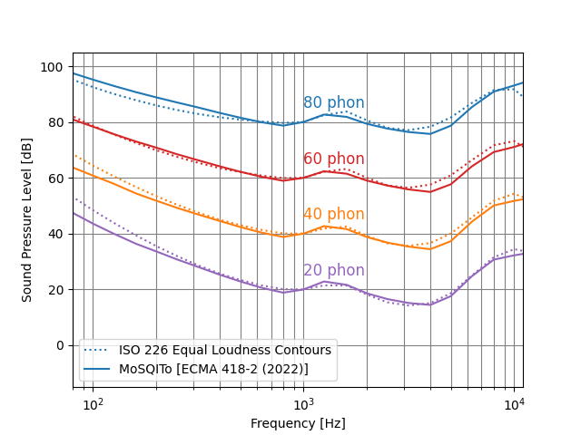

# MOSQITO Documentation
## Loudness according to ECMA 418-2

### Introduction
The acoustic loudness calculation according to the Hearing Model of Sottek is described on the ECMA 418-2 satndard. The method is in accordance with ISO 226:2003 equal loudness contours (instead of older ISO 226:1987 definition used for the Zwicker Loudness).

The result of the hearing model can be used as the basis for further psychoacoustic analyses (Psychoacoustic tonality according to ECMA-418-2 section 6 or roughness according to ECMA-418-2 section 7).

### Validation of the implementation
The ECMA loudness calculation is evaluated as proposed in the annex A of the standard. The loudness is calculated for sinusoidal signals with a frequency of 1000 Hz and a sound pressure level of 20 to 80 dB with a step size of 20 dB. For other frequencies, the level is varied to match the loudness calculated for the 1000 Hz tone. The results are shown in the figure below (to be compared to the Figure A.1 of the standard. The target equal-loudness contours are emulated well by the results of the hearing model.

*Results for the equal-loudness contours. The dotted lines show the target equal-loudness contours, the solid lines are the equal-loudness contours obtained with the MOSQITO hearing model implementation*

The validation plots and scripts can be found in [this folder](../validations/sq_metrics/loudness_ecma).

### References

ECMA-418-2, Psychoacoustic metrics for ITT equipment — Part 2 (models based on human perception), 1st edition (December 2020) [[available online](https://www.ecma-international.org/wp-content/uploads/ECMA-418-2_1st_edition_december_2020.pdf)]

ISO 226:2003, Acoustics — Normal equal-loudness-level contours 
