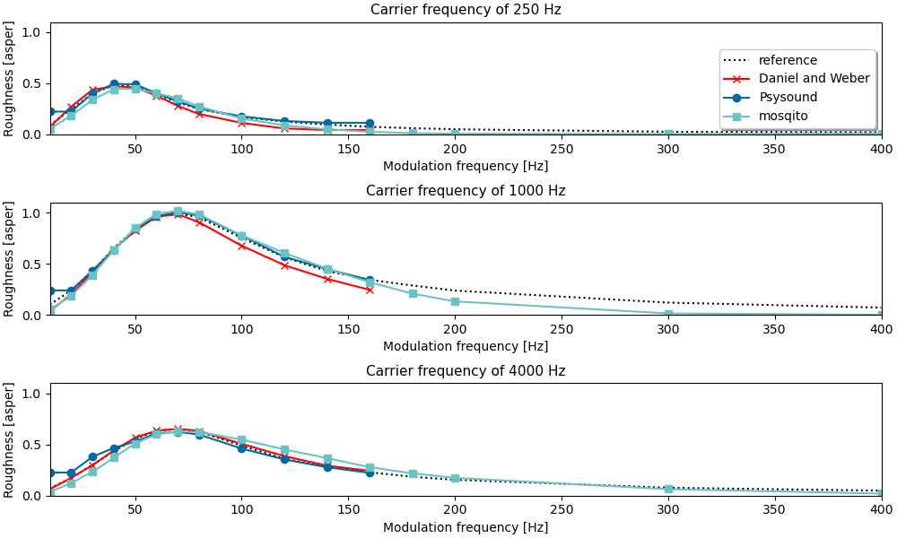

# MoSQITo Documentation
## Roughness calculation (Daniel and Weber)

### Introduction

Several models have been developed to calculate the acoustic roughness, but there is no official standardization yet. 

In MoSQITo, the code is based on the algorithm described in *Psychoacoustical roughness: implementation of an optimized model* published in Acustica by P.Daniel and R.Weber in 1997.
The roughness model consists of a parallel processing structure that is made up of successive stages and calculates intermediate specific roughnesses, which are summed up to determine the total roughness.
A step by step description of how to use MoSQITo to calculate the roughness from a .wav file is given in tutorial n°...

### Validation of the implementation

The validation procedure described in the article is based on a comparison with the results by H.Fastl and E.Zwicker in *Psychoacoustics*, Springer, Berlin, Heidelberg, 1990. 
The synthetic signals to be used as input for the calculation are generated using the 'test_signal_generation' script, in accordance with the equation (1) from the article. 

The plot below compare different roughness implementations' results for amplitude-modulated tones (carrier frequency of 250, 1000, 4000 Hz and modulation frequency from 10 to 400 Hz). 




Even if some values differ, the general tendency is correct.


Note : Mosqito succesfully reaches a value of 1 asper for a 1 kHz tone modulated at 70 Hz with a level of 60 dB.

An implementation test can be done by running the following command in the main MoSQITo folder: 

```python -m pytest mosqito -m roughness_dw``` 

_ (more accurate validation plots can be found in the [validations/roughness_danielweber folder](../mosqito/validations/roughness_danielweber)). 


### References

P.Daniel and R.Weber: *Psychoacoustical roughness: implementation of an optimized model*, Acustica acta.acustica, 1997.

H.Fastl and E.Zwicker: *Psychoacoustics*, Springer, Berlin, Heidelberg, 1990. 