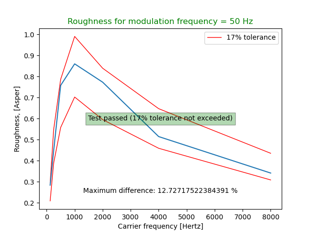
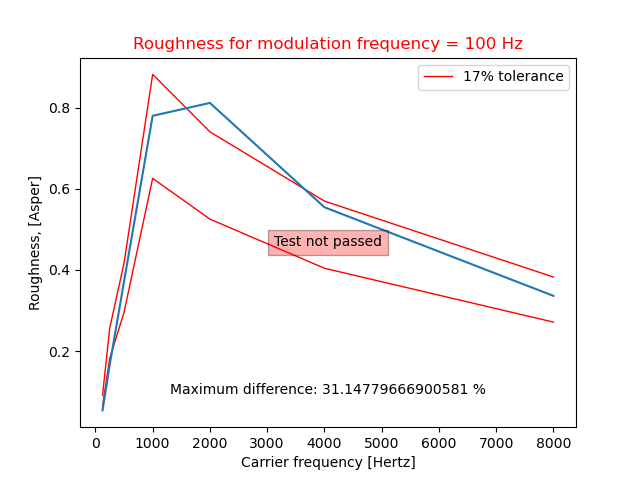

# MoSQITo Documentation
## Roughness calculation (Daniel and Weber)

### Introduction

Several models have been developed to calculate the acoustic roughness, but there is no official standardization yet. 

In MoSQITo, the code is based on the algorithm described in *Psychoacoustical roughness: implementation of an optimized model* published in Acustica by P.Daniel and R.Weber in 1997.
The roughness model consists of a parallel processing structure that is made up of successive stages and calculates intermediate specific roughnesses, which are summed up to determine the total roughness.
A step by step description of how to use MoSQITo to calculate the roughness from a .wav file is given in tutorial n°...

### Validation of the implementation

The validation procedure described in the article is based on a comparison with the results by H.Fastl and E.Zwicker in *Psychoacoustics*, Springer, Berlin, Heidelberg, 1990. 


The synthetic signals to be used as input for the calculation are generated using the 'test_signal_generation' script, in accordance with the equation (1) from the article. 
The plot below compare the MoSQITo roughness calculations for an amplitude-modulated tones (carrier frequency from 125 to 8000 Hz and modulation frequency of 50 Hz) to the compliance requirements given in the article. 
(all compliance plots can be found in the [tests/roughness/output folder](../mosqito/tests/roughness/output)). 




*Roughness calculation test signal n°4 (carrier frequency from 125 to 8000 Hz and modulation frequency of 50 Hz)*

MoSQITo implementation passes successfully 6 tests out of 20.


*Roughness calculation test signal n°4 (carrier frequency from 125 to 8000 Hz and modulation frequency of 100 Hz)*


The test on signal 9 fails because the 17% tolerance limit is exceeded for carrier frequencies of 2000 and 3000 Hz.

Note : all the plots can be obtained by runing the following command in the main MoSQITo folder: 

```python -m pytest mosqito -m roughness_dw``` 


### References

P.Daniel and R.Weber: *Psychoacoustical roughness: implementation of an optimized model*, Acustica acta.acustica, 1997.

H.Fastl and E.Zwicker: *Psychoacoustics*, Springer, Berlin, Heidelberg, 1990. 