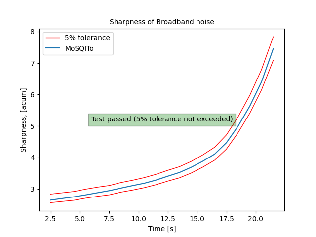
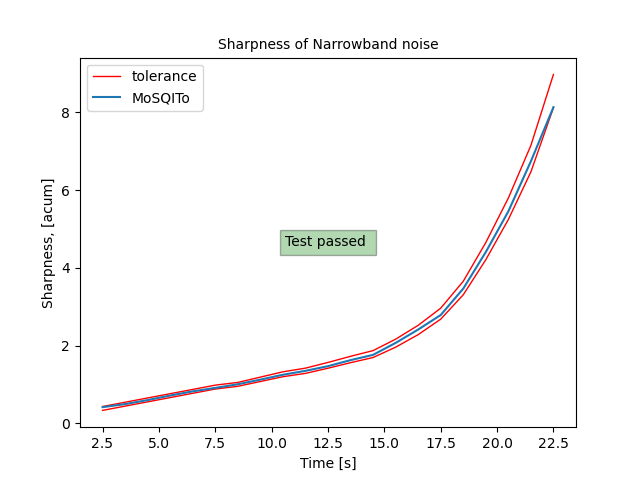

# MoSQITo Documentation
## Sharpness of stationary and time-varying signals (DIN 45692 method)

### Introduction

The acoustic sharpness calculation was introduced as a standard in the DIN 45692. The calculation is based upon the specific loudness distribution of the sound.

In MoSQITo, the code is based on the standard version published in 2009 and the loudness is calculated according to Zwicker method, as described in ISO 532:B.

### Validation of the implementation

The DIN 45692:2009 standard provides a set of synthetic and technical signals covering representative applications to be used to validate any of its implementation. The standards also provides the compliance requirements for a set of broad-band noises and narrow- band noises.


*Sharpness calculation for DIN 45692 broad-band test signals*


*Sharpness calculation for DIN 45692 narrow-band test signals*


Note : an  implementation test checking the compliance to the standard can be obtained by runing the following command in the main MoSQITo folder: 
```python -m pytest mosqito -m sharpness_din``` 


## Sharpness of stationary and time-varying signals (other methods)

Several other calculation methods can be found in Mosqito:
* Aures
* Von Bismarck
* Fastl

The calculation method remains the same, only the weighting functions change.


### References

DIN 45692_2009E, Messtechnische Simulation der Hörempfindung Schärfe (Measurement technique for the simulation of the auditory sensation of sharpness)

ISO 532-1:2017, Acoustics — Methods for calculating
loudness — Part 1: Zwicker method


