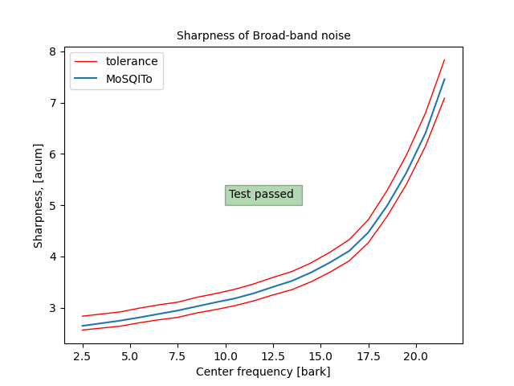
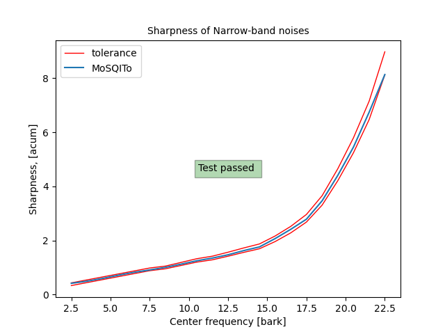

# MOSQITO Documentation
## Sharpness of stationary and time-varying signals (DIN 45692 method)

### Introduction

The acoustic sharpness calculation was introduced as a standard in the DIN 45692. The calculation is based upon the specific loudness distribution of the sound. The specific loudness is weighted by ponderation functions. By default, the 'din' weighting function is used in Mosqito.

The code is based on the version of the standard published in 2009 and the loudness is calculated according to Zwicker method, as described in ISO 532:B.

### Validation of the implementation

The DIN 45692:2009 standard provides a set of synthetic and technical signals covering representative applications to be used to validate any of its implementation. The standards also provides the compliance requirements for a set of broad-band noises and narrow-band noises. The sharpness is calculated by mosqito for the 20 broad-band signals  and for the 21 narrow-band signals filtered with different center frequencies provided with the standard. The results are compared to the requirements in the figures below.

*The validation plots and scripts can be found in [this folder](../mosqito/validations/sharpness).*

## Sharpness of stationary and time-varying signals (other methods)

Several other calculation methods can be found in Mosqito:
* Aures
* Von Bismarck
* Fastl

The calculation method remains the same, only the weighting functions change.

### References

DIN 45692_2009E, Messtechnische Simulation der Hörempfindung Schärfe (Measurement technique for the simulation of the auditory sensation of sharpness)

ISO 532-1:2017, Acoustics — Methods for calculating
loudness — Part 1: Zwicker method

